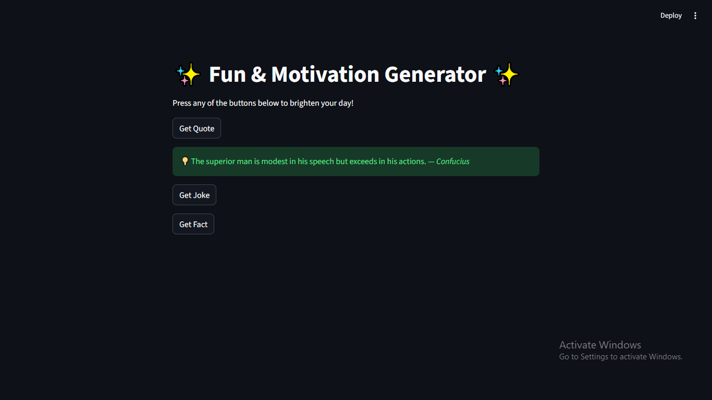

# ✨ AI Quote & Fun Generator ✨

A Streamlit web app that fetches **motivational quotes, random jokes, and fun facts** using public APIs.  
Built with Python, Streamlit, and requests library. Perfect for daily inspiration and fun!

## Screenshots



## Features

- Fetches **motivational quotes** from Quotable API  
- Fetches **random jokes** from Official Joke API  
- Fetches **fun facts** from Useless Facts API  
- Responsive **Streamlit UI** with buttons and styling  
- **Caching** implemented to reduce API calls and improve performance
  
## Installation

1. Clone the repo:
```bash
git clone https://github.com/<your-username>/ai-quote-generator.git
```
2. Navigate to the folder:
```bash
cd ai-quote-generator
```
3. Create and activate virtual environment:
```bash
python -m venv .venv
# Windows
.venv\Scripts\activate
# macOS/Linux
source .venv/bin/activate
```
4. Install dependencies:
```bash
pip install -r requirements.txt
```
5. Run the app:
```bash
streamlit run app.py
```
## Deployment

The app will be deployed on [Streamlit Cloud](https://streamlit.io/cloud) — live link coming soon!


## Tech Stack
- Python 3  
- Streamlit  
- requests library  
- Public APIs: Quotable, Official Joke API, Useless Facts API


## Authors

- github - [@ankithajade](https://github.com/ankithajade)
- linkedin -  https://www.linkedin.com/in/ankitha-jade

